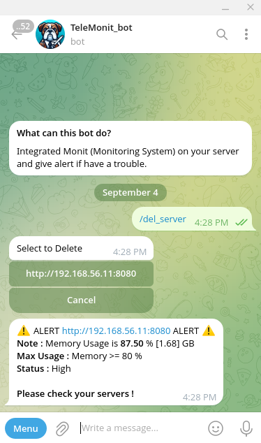
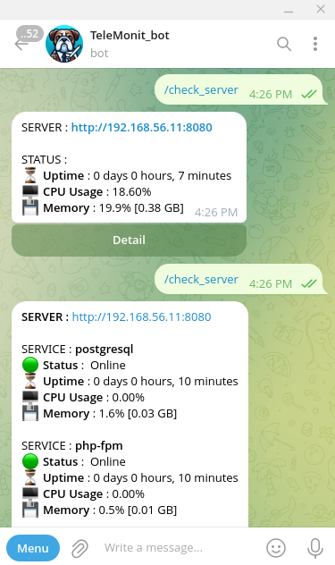
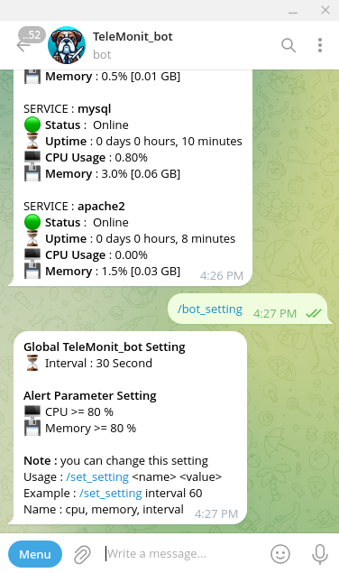

# TeleMonit_bot

A telegram bot project integrated with Monit, you can monitor the system easily and get an alarm if there is a problem on the server directly with the telegram bot.

## Feature

- Realtime monitoring
- Multiple Server
- Monitoring Event (Service running, uptime, CPU usage, memory usage)
- Alert (Timeout, server down, high CPU, high memory)
- Settings (interval, cpu and memory usage)

## Preparing Install
- First create your TelegramBot with https://t.me/BotFather
- Check your chat_id with open this link in browser `https://api.telegram.org/bot<YourBOTToken>/getUpdates` \
try to chat your bot and you can see detail of your private chat_id/group_id in browser link.
- Or user TelegramBot https://t.me/myidbot to see your ID

## How to Install

```bash
# Pull reposiroty
git clone https://github.com/tresnax/telemonit_bot.git | cd telemonit_bot

# Create .env file and insert below
TELEGRAM_BOT_TOKEN=yourbottoken
TELEGRAM_CHAT_ID=yourchatid

# Create venv (optional)
python venv .venv
source .venv/bin/activate

# Install Dependency
pip install -r requirements.txt

# Create Database
python createdb.py

# Running Apps
nohup python app.py &
```

## Install with Docker

```bash
# Create Volume
docker volume create telemonit_bot

# Run Docker
docker run -d --name telemonit_bot \
-e TELEGRAM_BOT_TOKEN=yourtokenbot \
-e TELEGRAM_CHAT_ID=yourchatid \
-v telemonit_bot:/app \
tresnax/telemonit_bot:latest
```

## Bot Command
- /start - see the description
- /check_server - check status server
- /add_server - add new server monitor
- /list_server - view all servers
- /del_server - delete server list
- /bot_setting - setting bot
- /set_setting - set your interval setting


## Screenshoots
<div style="display: flex; justify-content: space-around;">
    
    
    
</div>

## Notes
I hope you enjoy with my project 😁